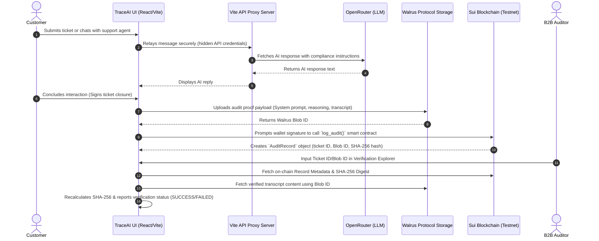

# ✦ TraceAI: Cryptographic Support Auditing Ledger ✦

[](https://opensource.org/licenses/MIT)
[](https://sui.io/)
[](https://walrus.xyz/)

TraceAI is a next-generation B2B customer support platform designed for modern decentralized applications and enterprise clients. By combining LLM-powered support agents with **Sui blockchain** ledgers and **Walrus Protocol** decentralized storage, TraceAI ensures that customer support interactions, refund requests, and escalations are 100% compliant, cryptographically signed, and auditable by third parties.

---

## 📖 Table of Contents

- [Vision & Use Case](#-vision--use-case)
- [System Architecture](#-system-architecture)
- [Core Features](#-core-features)
- [Technology Stack](#-technology-stack)
- [Project Structure](#-project-structure)
- [Getting Started](#-getting-started)
  - [Prerequisites](#prerequisites)
  - [Installation](#installation)
  - [Environment Configuration](#environment-configuration)
  - [Running the Application](#running-the-application)
- [Smart Contract Deployment](#-smart-contract-deployment)
- [Security & Cryptography](#-security--photography)
- [License](#-license)

---

## 💡 Vision & Use Case

In standard SaaS and enterprise web settings, customer support chats are locked in proprietary databases. This lack of transparency leads to:
1. **Compliance Gaps:** Customers and company auditors cannot verify if support agents strictly followed corporate guidelines (e.g., maximum refund policies, deactivation disclosures).
2. **Data Manipulation:** Transcripts can be edited, deleted, or falsified in internal databases after disputes arise.
3. **Audit Inefficiencies:** Resolving dispute claims requires manual reviews of disjointed chat history databases.

**TraceAI** solves these issues by creating an immutable, cryptographically chained audit ledger:
- Every support ticket conversation is summarized and validated against business constraints.
- The transcript and verification metadata are bundled and stored on the **Walrus sharded storage network**.
- A unique cryptographic SHA-256 digest of the interaction and the Walrus blob pointer are anchored directly on the **Sui blockchain** through client-signed transactions.
- A **Verification Explorer** lets any auditor or client verify the exact chat transcript against on-chain records.

---

## 🏗 System Architecture



---

## 🚀 Core Features

### 1. B2B Admin Dashboard
* **Prompt & Guardrail Configuration:** Admins can adjust the system prompts and enforce strict financial thresholds (e.g., refund limits of $50).
* **AI Model Selection:** Toggle between different OpenRouter models to optimize speed, intelligence, and cost.
* **Audit Logs Feed:** Monitor active tickets, view whether they were resolved, escalated, or denied, and track live Walrus blob IDs and Sui transaction hashes.

### 2. Customer Chat Widget
* **AI Agent (KIRO):** A contextual chatbot that answers customer questions while adhering to live guardrail policies.
* **Sui Wallet Integration:** Uses `@mysten/dapp-kit` to connect to Sui wallets (Sui Wallet, Suiet, etc.).
* **On-Chain Log Commitment:** When tickets are closed or processed, users/agents sign a transaction committing the cryptographic audit trail onto the blockchain.

### 3. Verification Explorer
* **De-siloed Audits:** Anyone can query any historical interaction using a Walrus `blobId` or ticket reference.
* **Integrity Validation:** Automatically hashes the retrieved Walrus JSON transcript and compares it with the Sui blockchain ledger entry to detect any post-closure modifications.

---

## 🛠 Technology Stack

* **Frontend:** React 19, TypeScript, Vite 8, Tailwind CSS, Framer Motion (smooth animations), Lucide React (vector icons).
* **Blockchain (Sui):** `@mysten/dapp-kit` for react hooks, `@mysten/sui` TS SDK, Move Smart Contracts (Testnet).
* **Decentralized Storage:** Walrus Protocol (Testnet HTTP API gateway for publishing/aggregating).
* **AI Integration:** Secure Vite server-side API proxy, communicating with OpenRouter completions endpoint.

---

## 📁 Project Structure

```text
├── move/                       # Sui Move Smart Contract Module
│   ├── sources/
│   │   └── audit_ledger.move   # Move contract representing the Audit Ledger Object
│   ├── Move.toml               # Package dependencies (Sui Framework)
│   └── Published.toml          # Testnet deployment details
├── server/                     # Node/Vite Server Components
│   └── api.ts                  # OpenRouter API proxy middleware & config status provider
├── src/                        # React Frontend Source Code
│   ├── assets/                 # Brand assets
│   ├── components/             # UI Components
│   │   ├── ChatWidget.tsx      # Support UI & on-chain interaction logic
│   │   ├── Dashboard.tsx       # Admin parameters & ticket listing
│   │   └── VerificationExplorer.tsx # Audit ledger validation dashboard
│   ├── services/
│   │   └── walrus.ts           # Walrus storage connector & simulation fallback
│   ├── App.tsx                 # Application layout, wallet triggers, & navigation
│   ├── main.tsx                # Dapp-kit providers & client bootstrapping
│   └── index.css               # Neo-brutalist styling system & color tokens
├── .env                        # Configuration parameters
├── tailwind.config.js          # Styling configurations
└── vite.config.ts              # Vite configurations with custom server middleware
```

---

## 🏁 Getting Started

### Prerequisites
* [Node.js](https://nodejs.org/) (version 18 or higher recommended)
* A modern web browser with a Sui-compatible browser extension (e.g., [Sui Wallet](https://sui.io/wallet) or [Suiet](https://suiet.app/)) loaded with Sui Testnet tokens.

### Installation

Clone the repository directly from the official source:

```bash
git clone https://github.com/sandman-sh/TraceAI.git
cd TraceAI
```

Install the dependencies:

```bash
npm install
```

### Environment Configuration

Create or modify your `.env` file in the root directory. You can use the following values as a guide:

```env
# The deployed Sui Move Package ID on Sui Testnet
VITE_SUI_PACKAGE_ID=0xe83ee2ad95984f94e2f062fc73796282c81895c49606d35a4f8f8ab55118b70b

# OpenRouter AI API Key (Required for LLM features)
VITE_OPENROUTER_API_KEY=your_openrouter_api_key_here

# OpenRouter AI Model Identifier 
VITE_OPENROUTER_MODEL=meta-llama/llama-3-8b-instruct:free
```

### Running the Application

To run the application locally (which spins up the Vite development server containing the integrated backend OpenRouter API middleware):

```bash
npm run dev
```

The application will launch. Open [http://localhost:5173](http://localhost:5173) in your web browser.

*Note: The API proxy will run securely within the dev server, meaning your `VITE_OPENROUTER_API_KEY` is never exposed to the client browser.*

---

## 📜 Smart Contract Deployment

The Sui Move contract is stored in the `/move` directory. 

### Compilation
To build and check your Move code, ensure you have the [Sui CLI installed](https://docs.sui.io/guides/developer/getting-started/sui-install) and run:

```bash
cd move
sui move build
```

### Publishing to Sui Testnet
To publish the package onto the Sui Testnet, run:

```bash
sui client publish --gas-budget 200000000
```

Once published, update the `VITE_SUI_PACKAGE_ID` variable in your `.env` file with the newly generated package ID.

---

## 🔒 Security & Cryptography

1. **API Key Isolation:** The Vite development server uses custom backend middleware that routes AI prompts. This keeps corporate OpenRouter API keys securely on the server environment.
2. **Tamper Proofing:** Prior to saving the interaction proof to Walrus, the system computes a SHA-256 hash:
   $$\text{digest} = \text{SHA-256}(\text{systemPrompt} + \text{reasoning} + \text{transcriptJSON})$$
   Because the on-chain Sui ledger records this exact digest, any change to the transcript text or the agent parameters will cause a mismatch during the verification process, flagging the record immediately.
3. **Decentralized Ownership:** By storing transcripts in Walrus blobs and referencing them on Sui, customers retain verifiable proofs of their interactions that cannot be retracted by the B2B provider.

---

## 📄 License

Distributed under the MIT License. See [LICENSE](https://github.com/sandman-sh/TraceAI/blob/main/LICENSE) (if available) or standard MIT license parameters for details.

---
*Created professionally for **TraceAI** | GitHub Repo: [sandman-sh/TraceAI](https://github.com/sandman-sh/TraceAI.git)*
